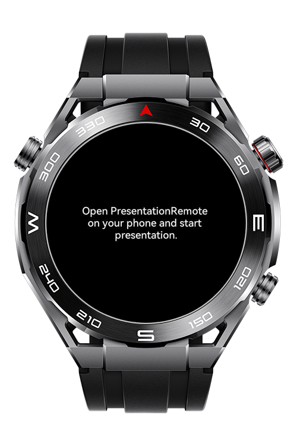
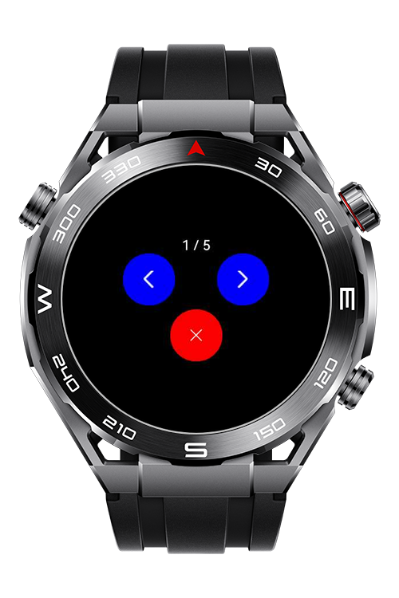

> **Note:** To access all shared projects, get information about environment setup, and view other guides, please visit [Explore-In-HMOS-Wearable Index](https://github.com/Explore-In-HMOS-Wearable/hmos-index).

# PresentationRemoteLite

This app demonstrates how to control a presentation app using wear engine.

# Preview

<div>
  
  
  
</div>

# Use Cases

- Use wear engine to control your presentation.
- Go previous and next slides.
- Close presentation.

# TechStack

- **Languages**: HML, JS
- **Frameworks**: 4.0.0(10)
- **Tools**: DevEco Studio Version 5.1.1.830
- **Libraries**: @system.wearengine

# Directory Structure

```
entry/src/main/js/MainAbility
│   app.js
├───common
│   │   chevron_left.png
│   │   chevron_right.png
│   │   retry.png
│   │   xmark.png
│   └───js
│           utils.js
├───pages
│   └───index
│           index.css
│           index.hml
│           index.js
└───util
        wearengine.js
```

# Constraints and Restrictions

## Supported Device

- Huawei Sport (Lite) Watch GT 4/5/6
- Huawei Sport (Lite) GT4/5 Pro
- Huawei Sport (Lite) Fit 3/4
- Huawei Sport (Lite) D2
- Huawei Sport (Lite) Ultimate

# License

**PresentationRemoteLite** is distributed under the terms of the MIT License
See the [LICENSE](./LICENSE) for more information.
